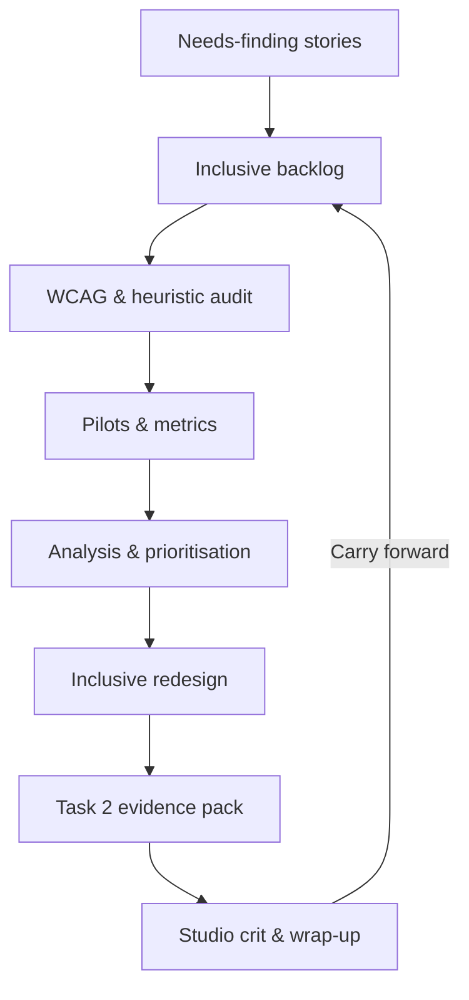

```mermaid
graph TD
  A[Needs-finding stories] --> B[Inclusive backlog]
  B --> C[WCAG & heuristic audit]
  C --> D[Pilots & metrics]
  D --> E[Analysis & prioritisation]
  E --> F[Inclusive redesign]
  F --> G[Task 2 evidence pack]
  G --> H[Studio crit & wrap-up]
  H -->|Carry forward| B
```